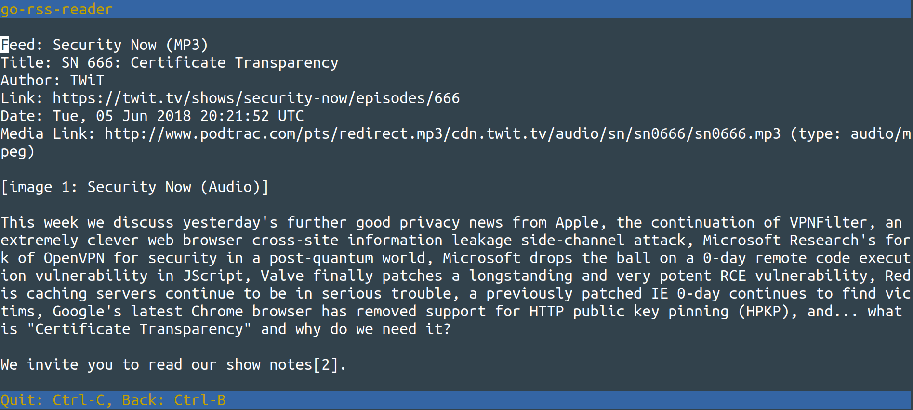

# go-rss-reader

        

My attempt at making a terminal rss reader (based off newsbeuter)

## Dependencies
- Sqlite3

## Setup
The application assumes that you have two things:

- ~/.go-rss-reader directory in your home path
-  ~/.go-rss-reader/urls file that lists a rss feed url (one per line)

## Build Instructions

- Clone this repo
- build _examples/rss-reader.go
- (recommendation) add rss-reader to your PATH

## Commands
All commands are CTRL + char (with the exception of Enter, which allows you to select a feed of an episode).

- b: Back
- c: Quit
- r: Refresh feed
- a: Refresh all feeds

## Gotchas

- Refreshing all feeds will lock up the screen until the application has finished updating all the feeds. If this lag time bothers you, I would recommend refreshing your feeds individually.